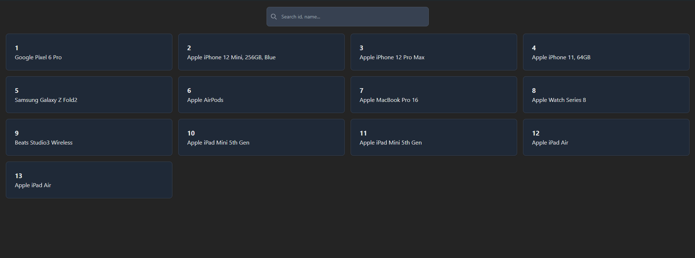

---

# Dynamic Card Grid with React, Vite, and TailwindCSS



Welcome to the **Dynamic Card Grid** project! This is where we take boring API data and turn it into a vibrant, animated grid of cards, because plain lists are so last century.

## Table of Contents

- [Introduction](#introduction)
- [Features](#features)
- [Getting Started](#getting-started)
- [Usage](#usage)
- [Technologies](#technologies)
- [Contributing](#contributing)
- [License](#license)
- [Contact](#contact)

## Introduction

Are you tired of static and lifeless data displays? Want to add some pizzazz to your project? Look no further! This project showcases how to create a dynamic card grid that fetches data from an API, displays it in a beautiful grid format, and includes smooth transition animations. 

## Features

- **Dynamic Data Fetching**: We pull data straight from the API. It's like magic, but with more JavaScript.
- **Search Functionality**: Type away and watch the cards filter in real-time. It's almost like Google, but not quite.
- **Smooth Animations**: The cards fade in and scale up like they’ve had a double espresso.
- **Responsive Design**: Whether you’re on a phone, tablet, or a screen the size of a small country, our grid adjusts accordingly.
- **Dark Mode**: Because even your cards deserve to look cool at night.

## Getting Started

### Prerequisites

Before you begin, make sure you have Node.js installed. If not, visit the [official Node.js website](https://nodejs.org/) to download and install it. 

### Installation

1. Clone this repository:
    ```bash
    git clone https://github.com/Jothivaanan-WebDeveloper/dynamic-card-grid.git
    ```
2. Navigate to the project directory:
    ```bash
    cd dynamic-card-grid
    ```
3. Install the dependencies:
    ```bash
    npm install
    ```
4. Start the development server:
    ```bash
    npm run dev
    ```

Now open your browser and go to `http://localhost:3000`. Voilà! Your dynamic card grid is up and running.

## Usage

1. **Fetching Data**:
   - We fetch data from an API (replace the URL in the code with your actual API endpoint). If the API had a face, it would be smiling at how efficiently we fetch its data.

2. **Searching**:
   - Type into the search bar and watch as the grid dynamically updates. It’s like talking to your cards and them actually listening!

3. **Enjoy the Animations**:
   - Watch the cards smoothly fade in and scale up. We guarantee you’ll want to search and clear just to see it again. And again.

## Technologies

- **React**: Because building UIs should be fun.
- **Vite**: For an extremely fast development environment. Seriously, blink and you’ll miss the build.
- **TailwindCSS**: Utility-first CSS framework to style your app faster than a speeding bullet.
- **JavaScript**: The language of the web. Also known as "that thing that keeps changing."

## Contributing

Contributions are welcome! If you have improvements, bug fixes, or just want to add more humor, feel free to fork the repository and create a pull request. Let’s make this project even more awesome together!

## License

This project is licensed under the MIT License. Because sharing is caring.

## Contact

If you have any questions or just want to say hi, feel free to reach out:

- GitHub: [Joe](https://github.com/Jothivaanan-WebDeveloper)

---
